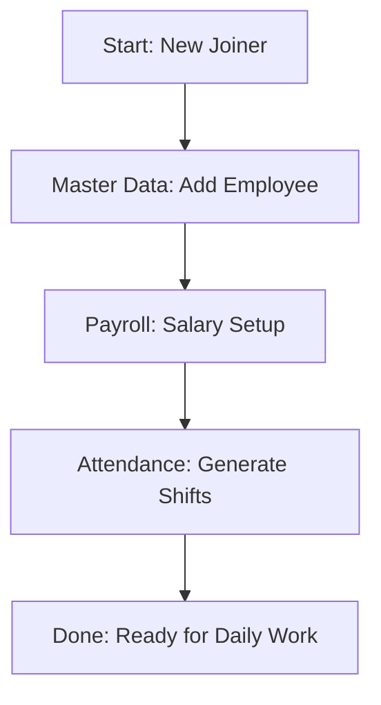

# Fullstack ERP - Complete User Manual

A step-by-step guide for HR administrators and managers. This manual is designed so that **anyone with no prior experience** can use the system confidently.

---

## Table of Contents
1. [System Overview](#1-system-overview)
2. [Step-by-Step Process Flows](#2-step-by-step-process-flows)
   - [2.1 Adding a New Employee](#21-adding-a-new-employee)
   - [2.2 Managing Daily Attendance](#22-managing-daily-attendance)
   - [2.3 Processing Monthly Payroll](#23-processing-monthly-payroll)
   - [2.4 Handling Leave Applications](#24-handling-leave-applications)
   - [2.5 Managing Overtime (OT)](#25-managing-overtime-ot)
   - [2.6 Marking an Employee as Left](#26-marking-an-employee-as-left)
3. [Module-wise Guide](#3-module-wise-guide)
4. [Quick Reference](#4-quick-reference)

---

## 1. System Overview

### 1.1 Login Screen
When you open the application, you will see a login screen:
- Enter your **Username** and **Password**
- Click **Login** button
- If credentials are correct, you will see the Dashboard

### 1.2 Main Dashboard
After logging in, you see the main dashboard showing:
- Quick stats (Total Employees, Present Today, Pending Approvals, etc.)
- Quick action buttons
- Recent activity

### 1.3 Sidebar Navigation
The sidebar (left side) contains all menus organized into categories:

| Category | What it Contains |
|----------|-----------------|
| **Dashboard** | Home page with overview |
| **Master Data** | Employee records, leave types, shifts, holidays |
| **Attendance** | Shift schedules, daily attendance, OT approval |
| **Transactions** | Leave, On-duty, Tour, Advance applications |
| **Payroll** | Salary setup and processing |
| **Reports** | Exportable reports |

### 1.4 Common Elements on All Pages
Every page in the system has these elements:

```
┌─────────────────────────────────────────────────────────────┐
│  [Page Title]                          [Filter Controls...] │
│                                                              │
│  [Refresh Button] [Clear Button]     ← These work together  │
│                                                              │
│  [Search Box] [Dropdown Filters...]                          │
│                                                              │
│  [Table with Data]                                           │
│                                                              │
└─────────────────────────────────────────────────────────────┘
```

- **Refresh Button**: Reloads data but keeps your filters
- **Clear Button**: Resets all filters to default values
- **Search Box**: Type to filter results
- **Dropdowns**: Select specific options to filter

---

## 2. Step-by-Step Process Flows

### 2.0 Visual Workflow Overview

If you are new to the system, follow these visual maps to understand how different tasks connect:

#### A. New Employee Setup Flow


#### B. The Payroll "Golden Loop" (Every Month)


---

### 2.1 Adding a New Employee

**Who does this:** HR Administrator
**When:** A new person joins the company

#### Step 1: Navigate to Employee Master
1. Click on **Master Data** in the sidebar
2. Click on **Employee Master**
3. You will see a list of existing employees

#### Step 2: Click Add Employee
1. Look for the **"+ Add Employee"** button (usually at the top right)
2. Click on it
3. A form will open with multiple tabs

#### Step 3: Fill in Personal Details (First Tab)
You will see fields like:
- **Employee ID**: System will auto-generate (or enter manually)
- **First Name**: Enter first name
- **Last Name**: Enter last name
- **Date of Birth**: Click calendar icon and select date
- **Gender**: Select from dropdown (Male/Female/Other)
- **Blood Group**: Select from dropdown
- **Marital Status**: Select from dropdown
- Click **Next** or the second tab

#### Step 4: Fill in Official Details (Second Tab)
- **Company/Unit**: Select from dropdown
- **Department**: Select from dropdown
- **Designation**: Select or type designation
- **Date of Joining**: Select date
- **Employment Type**: Select (Permanent/Contract/Intern)
- Click **Next** or the third tab

#### Step 5: Fill in Contact Details (Third Tab)
- **Permanent Address**: Street, City, State, PIN
- **Communication Address**: Same as above (or different)
- **Phone/Mobile**: Enter contact number
- **Email**: Enter email address
- Click **Save** button

#### Step 6: Verify & Confirm
1. After saving, you will see the employee in the list
2. The employee will now appear in:
   - Employee Master Report
   - Attendance lists
   - Payroll (after salary setup)

#### Common Mistakes to Avoid:
❌ Don't leave required fields (marked with *) empty
❌ Don't enter future date of joining
❌ Don't forget to select Department and Designation

---

### 2.2 Managing Daily Attendance

**Who does this:** HR Administrator or Manager
**When:** Every day to record attendance

#### Understanding Attendance Status Codes:

| Code | Meaning | Color Usually |
|------|---------|--------------|
| P | Present | Green |
| A | Absent | Red |
| W | Weekly Off | Purple |
| H | Holiday | Blue |
| EL | Earned Leave | Yellow |
| SL | Sick Leave | Yellow |
| CL | Casual Leave | Yellow |
| OD | On Duty | Cyan |
| Tour | On Tour | Orange |

#### Process Flow:

##### Method 1: Individual Entry (For 1-2 employees)

**Step 1:** Go to HR Attendance
1. Click **Attendance** in sidebar
2. Click **HR Attendance**

**Step 2:** Select Date and Employee
1. In the filter section, select **Date** filter type
2. Choose the date (e.g., today's date)
3. Select employee from dropdown (or leave for all)
4. Click **Refresh**

**Step 3:** Enter Attendance
1. Find the employee in the table
2. Click on the **In Time** field → Enter time (e.g., 09:05)
3. Click on the **Out Time** field → Enter time (e.g., 18:00)
4. The system will automatically:
   - Calculate **Late Hours** (if in time > shift start)
   - Calculate **OT Hours** (if out time > shift end)
5. Click **Save** button

##### Method 2: Bulk Entry (For many employees)

**Step 1:** Go to HR Attendance
1. Click **Attendance** → **HR Attendance**
2. Select date range or month

**Step 2:** Switch to Bulk Entry Mode
1. Look for **"Bulk Entry"** button
2. Click it
3. A grid will appear showing all employees

**Step 3:** Enter Times in Grid
1. Fill in times for each employee
2. Use Tab key to move between fields quickly
3. Status will auto-update based on times

**Step 4:** Save All
1. Click **Save All** button
2. Confirmation message will appear

#### Step-by-Step: Generating Shift Schedules

Before attendance can be recorded, employees need shift schedules:

**Step 1:** Go to Shift Schedule
1. Click **Attendance** → **Shift Schedule**

**Step 2:** Generate Monthly Shifts
1. Select **Year** and **Month** (e.g., April 2026)
2. Click **Generate Monthly Shifts** button
3. System will create shift schedules for all active employees
4. Default shift: 09:00 AM to 06:00 PM (can be customized)

**Step 3:** Verify Generated Shifts
1. Use filters to check specific employees
2. Modify individual shifts if needed by clicking edit

---

### 2.3 Processing Monthly Payroll

**Who does this:** HR Administrator or Payroll Manager
**When:** End of every month (after 25th)

#### Prerequisites (Must be done first):
✅ All employees have salary setup (Section 5.1)
✅ Attendance for the entire month is recorded
✅ All leave applications are approved
✅ OT approvals are completed

#### Step-by-Step Process:

##### Step 1: Set Up Salaries (First Time Only / When New Employee Joins)

1. Go to **Payroll** → **Salary Setup**
2. You will see a table of all active employees
3. Click the **Edit** (pencil) icon on an employee's row
4. Enter salary components:
   - **Basic**: Base salary amount
   - **HRA**: House Rent Allowance
   - **Conveyance**: Transportation allowance
   - **Washing Allowance**: Uniform allowance
5. Select eligibility toggles:
   - **PF**: Provident Fund (Yes/No)
   - **ESI**: Health Insurance (Yes/No)
   - **OT**: Overtime eligible (Yes/No)
6. Click **Save**

##### Step 2: Process Monthly Salary

1. Go to **Payroll** → **Salary Processing**
2. Select **Year** and **Month** (e.g., March 2026)
3. Click **Process Payslip** button
4. Wait for processing to complete (shows progress)
5. Review the data in three tabs:

   **Tab 1 - Basic Data:**
   - Shows fixed salary components for each employee
   - Verify this matches your salary setup

   **Tab 2 - Attendance Details:**
   - **Physical**: Days actually worked
   - **Woffs**: Weekly offs
   - **Holidays**: Company holidays
   - **Leaves**: Approved leaves
   - **Tour**: Days on tour
   - **Absent**: Days absent
   - **LOP**: Loss of Pay days
   - **Total Paid**: Days counted for salary
   - **OT Hrs**: Overtime hours (from approved OT)
   - **Late Times**: Number of times late

   **Tab 3 - Processed Salary:**
   - Shows final calculation with:
     - Earned Basic, HRA, Conveyance
     - OT Earnings (based on approved OT)
     - Deductions (PF, ESI, PT, Late Deductions)
     - **Net Pay**: What the employee receives

##### Step 3: Generate Test Data (For New Month Setup)

If processing for a new month for the first time:
1. Click **Generate [Month] [Year] Data** button
2. This will create:
   - Shift schedules for all employees
   - Attendance records (marked as P by default)
   - Set up for salary processing

##### Step 4: View/Print Payslips

1. Go to **Payroll** → **Payslip View/Create**
2. Select **Year** and **Month**
3. Click **Refresh**
4. Find the employee in the list
5. Click **Print** or **PDF** icon to print payslip

---

### 2.4 Handling Leave Applications

#### For Employees (How to Apply for Leave):

**Step 1:** Go to Leaves
1. Click **Transactions** → **Leaves**

**Step 2:** Apply for Leave
1. Click **+ Apply for Leave** button
2. Fill in the form:
   - **Leave Type**: Select (CL, EL, SL, etc.)
   - **From Date**: Start date of leave
   - **To Date**: End date of leave
   - **Reason**: Why are you taking leave?
3. Click **Submit**

**Step 3:** Wait for Approval
- Your application will show as "Pending" (orange)
- Once approved, it will show "Approved" (green)
- Approved leaves count against your leave balance

#### For Managers/HR (How to Approve Leaves):

**Step 1:** Go to Leave Approval
1. Click **Transactions** → **Leaves**
2. Look for **"Approval"** section or tab

**Step 2:** Review Pending Applications
1. You will see a list of pending leave applications
2. Click on an application to view details:
   - Employee name and ID
   - Leave dates
   - Leave type
   - Reason

**Step 3:** Approve or Reject
1. **To Approve:**
   - Click **Approve** button
   - Add remarks if needed (e.g., "Approved as requested")
   - Click **Confirm**

2. **To Reject:**
   - Click **Reject** button
   - Add reason for rejection
   - Click **Confirm**

#### Leave Application Status Flow:
```
Employee Submits → [Pending] → Manager Reviews → [Approved/Rejected]
                                    ↓
                           Approved leaves count
                           in payroll calculation
```

---

### 2.5 Managing Overtime (OT)

#### Understanding OT Calculation:

The system automatically calculates OT based on:
- **Shift End Time** (from shift schedule)
- **Actual Out Time** (from attendance)

**Formula:** OT = Actual Out Time - Shift End Time

**Example:**
- Shift End: 18:00 (6:00 PM)
- Actual Out: 20:00 (8:00 PM)
- OT = 20:00 - 18:00 = **2 hours**

#### Step-by-Step: Approving OT

**Step 1:** Go to OT Approval
1. Click **Attendance** → **OT Approval**

**Step 2:** View Pending OT
1. You will see two sections:
   - **Regular OT**: Based on attendance out times
   - **Ext OT**: Extra OT for weekly offs/holidays

**Step 3:** Review OT Hours
1. Find the employee
2. Check the **Actual OT** column (auto-calculated)
3. Verify **Manager OT** column

**Step 4:** Approve/Modify
1. Click **Approve** button on the row
2. Optionally modify the OT hours if needed
3. Add remarks
4. Click **Save**

**Step 5:** HR Final Approval
1. Once manager approves, HR reviews
2. HR clicks **HR Approve** to finalize
3. Finalized OT will be included in payroll

#### Important Notes:
- Only **Approved OT** gets included in salary
- OT rate is configured in salary setup (OT = Yes/No)
- Regular OT comes from out-punch times
- Ext OT is manually added for special circumstances

---

### 2.6 Marking an Employee as Left

**Who does this:** HR Administrator
**When:** An employee resigns or is terminated

#### Step-by-Step Process:

**Step 1:** Find the Employee
1. Go to **Master Data** → **Employee Master**
2. Search for the employee by name or ID
3. Click **Edit** (pencil icon) on their row

**Step 2:** Update Employee Status
1. Scroll down to find **Employment Status** or **Status** field
2. Change from "Active" to "Left" or "Resigned"
3. Enter **Left Date**: The date they actually left
4. Enter **Reason for Leaving**: Optional but recommended

**Step 3:** Save Changes
1. Click **Save** button
2. The employee will be moved to "Left Employee List"

#### What Happens Automatically:
✅ Employee removed from active employee lists
✅ Employee excluded from payroll processing
✅ Employee excluded from attendance calculations
✅ Employee hidden from salary setup

#### To View Left Employees:
1. Go to **Master Data** → **Left Employee List**
2. You can see all left employees with:
   - Name and ID
   - Left Date
   - Reason for Leaving

#### To Reactivate (If Employee Returns):
1. Go to **Left Employee List**
2. Click **Edit** on the employee
3. Change status back to "Active"
4. Set new Date of Joining if applicable
5. Click **Save**

---

## 3. Module-wise Guide

### 3.1 Dashboard

**What you see:**
- Total active employees count
- Employees present today
- Pending approvals count
- Recent activity

**What you can do:**
- Get a quick overview of system status
- Click on any card to go to that module

### 3.2 Master Data

#### Employee Master
- View all active employees
- Add, edit, delete employees
- Search by name, ID, department
- Export to Excel/PDF

#### Left Employee List
- View all departed employees
- See reason for leaving
- Can reactivate if needed

#### Leaves Master
- Configure available leave types
- Set annual limits
- Define carry-forward rules

#### Shift Master
- Create shift definitions
- Set shift timings (start, end, break)
- Examples: General, Morning, Night shifts

#### Holiday Master
- Add company holidays
- Mark as optional or mandatory
- Filter by year

### 3.3 Attendance

#### Shift Schedule
- Generate monthly shifts in bulk
- Assign individual shifts
- View/edit existing schedules
- **Important**: Shifts must be generated before attendance

#### HR Attendance
- View/edit daily attendance
- Single date or range view
- Bulk entry mode for quick entry
- Auto-calculation of late and OT

#### Muster Roll
- Calendar view of attendance
- Color-coded by status
- Weekly navigation
- Monthly overview

#### OT Approval
- Review overtime claims
- Manager and HR approval levels
- Regular OT and Extra OT tabs

### 3.4 Transactions

#### Leaves
- Apply for leave (employees)
- Approve/reject leaves (managers)
- View leave balance
- Leave history

#### On Duty
- Apply for on-duty
- Upload supporting documents
- Approval workflow

#### Tour
- Apply for official tour
- Enter destination and purpose
- Approval workflow

#### Advance
- Apply for salary advance
- Specify amount needed
- Approval workflow

#### Shift Change
- Request shift change
- Show current vs requested
- Approval workflow

#### Woff Change
- Request weekly off day change
- Approval workflow

#### ESI Leave
- Apply for ESI medical leave
- Medical document upload
- Approval workflow

### 3.5 Payroll

#### Salary Setup
- Configure salary for each employee
- Set Basic, HRA, Conveyance, etc.
- Toggle PF, ESI, OT eligibility
- Bulk import from CSV

#### Salary Processing
- Process monthly salaries
- Review in three stages:
  1. Basic Data (fixed salary)
  2. Attendance Details (worked days)
  3. Processed Salary (final calculation)
- Generate test data for new months

#### Payslip View/Create
- View processed payslips
- Create individual payslips
- Print or download as PDF

### 3.6 Reports

#### Employee Master Report
- Export all employee data
- Filter by division/department
- Search functionality

#### Leave Report
- View all leave applications
- Filter by date range
- Export capability

---

## 4. Quick Reference

### 4.1 Common Tasks and Where to Find Them

| Task | Go To |
|------|-------|
| Add new employee | Master Data → Employee Master → Add Employee |
| Record daily attendance | Attendance → HR Attendance |
| Generate monthly shifts | Attendance → Shift Schedule → Generate |
| Process salary | Payroll → Salary Processing → Process Payslip |
| Approve leave | Transactions → Leaves → Approval |
| Approve OT | Attendance → OT Approval |
| Set employee salary | Payroll → Salary Setup |
| View payslip | Payroll → Payslip View |
| Mark employee as left | Master Data → Employee Master → Edit → Change Status |
| Export reports | Reports → [Select Report] → Download |

### 4.2 Status Colors and Meanings

| Status | Color | Where Seen |
|--------|-------|------------|
| Pending | Orange | Leave, OT, Tour approvals |
| Approved | Green | Leave, OT, Tour approvals |
| Rejected | Red | Leave, OT, Tour approvals |
| Present | Green | Attendance |
| Absent | Red | Attendance |
| Weekly Off | Purple | Attendance |
| Holiday | Blue | Attendance |
| On Leave | Yellow | Attendance |

### 4.3 Keyboard Shortcuts

| Action | Shortcut |
|--------|----------|
| Move between fields | Tab |
| Save form | Ctrl + S (in most cases) |
| Close dialog | Escape |
| Search table | Ctrl + F (browser search) |

### 4.4 Filter Types by Page

| Page | Filter Options |
|------|---------------|
| HR Attendance | Date / Date Range / Month+Year + Employee |
| OT Approval | Date / Month+Year + Employee |
| Leave Approval | Start Date, End Date, App No, Employee, Search |
| Muster Roll | Month, Year, Employee |
| Salary Processing | Year, Month |
| Payslip List | Year, Month |
| Employee Master | Search, Division, Department |

### 4.5 What to Do When...

**When an employee joins:**
1. Add employee (Master Data → Employee Master)
2. Set salary (Payroll → Salary Setup)
3. Generate shift schedule (Attendance → Shift Schedule)

**When an employee leaves:**
1. Mark as left (Master Data → Employee Master → Edit)
2. System automatically excludes from payroll/attendance

**When processing month-end:**
1. Ensure all attendance is recorded
2. Approve all pending leaves
3. Approve all pending OT
4. Process payroll (Payroll → Salary Processing)

**When running payroll for new month:**
1. Generate shift schedules for the month
2. Record all attendance
3. Approve all leaves and OT
4. Process payslip
5. Review and print payslips

---

## 5. Troubleshooting

### Common Issues and Solutions

| Issue | Solution |
|-------|----------|
| Employee not showing in attendance | Generate shift schedule first |
| OT showing as 0 | Check shift end time and out time; ensure OT approval |
| Left employee in payroll | Mark as "Left" in employee master |
| Can't approve leave | Check if you have manager role |
| Payslip not generating | Ensure salary is set in Salary Setup |
| Refresh not working | Check if backend server is running |

### Getting Help

If you face issues not covered here:
1. Check the notification/messages in the system
2. Contact your system administrator
3. Note the exact error message if any

---

## Summary of Process Flows

```
NEW EMPLOYEE ONBOARDING:
Add Employee → Set Salary → Generate Shifts → (Ready for Attendance)

DAILY ATTENDANCE:
Generate Monthly Shifts → Record Attendance → (Attendance Recorded)

MONTH-END PAYROLL:
Record Attendance → Approve Leaves → Approve OT → Process Salary → Print Payslips

EMPLOYEE OFFBOARDING:
Mark as Left → (Auto-removed from active lists)
```

---

> **Remember**: The Refresh button is your friend! After any changes, click Refresh to see the updated data while keeping your filter settings.